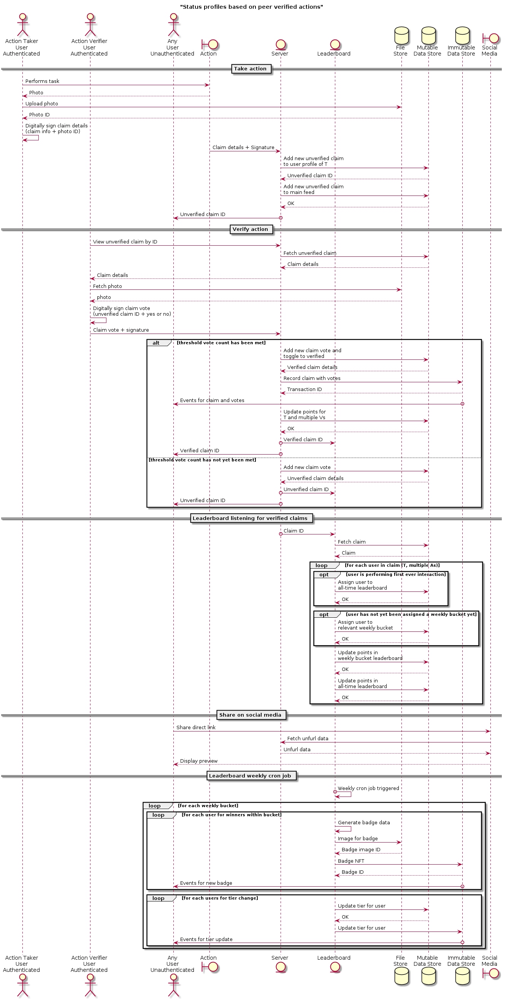

# Status based profiles for peer verified actions

## How it works

1. Users would take a picture and post it to their profile/ news feed (social media style)
2. Other users would vote 👍 or 👎
3. When a certain number of votes have been reached, points are awarded based on votes
    - TODO need to flesh out the economics here
4. All of this feeds into a tiered weekly leaderboard, as well as an all-time leaderboard

## Desired outcomes

- Users have profiles similar to social media dedicated to their actions
- Their actions are peer verified
- Raise awareness about individual actions that help focus are
- Peer pressure incentives to take individual actions that help focus area

## UML Sequence diagram

## Licence

GPL-3.0

## Author

[Brendan Graetz](http://bguiz.com)
